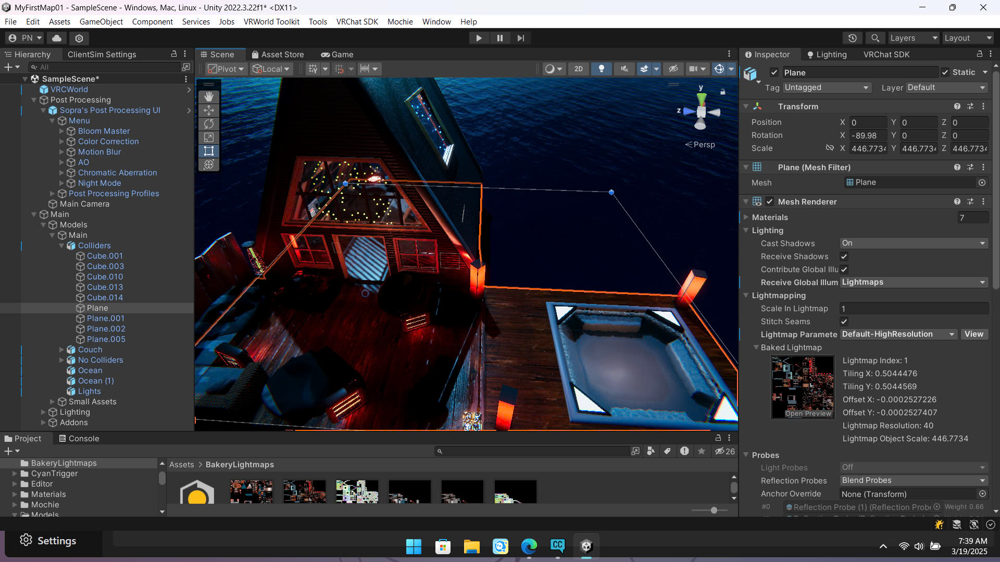

# 🌌 MyFirstMap01 – VRChat World

## 📖 Overview
**MyFirstMap01** is a custom VRChat world developed using **Unity 2022.3 LTS** and **VRChat SDK3**.  
The environment is designed as a night-time seaside retreat, featuring atmospheric lighting, neon accents, and immersive post-processing effects.

The goal of this project is to create a relaxing and visually engaging space for users to explore and socialize in VRChat.

---

## 🖼️ Preview

  

---

## ✨ Features
- Night-time ocean environment
- Baked lighting with detailed lightmaps
- Post-processing effects:
  - Bloom
  - Ambient Occlusion
  - Color Grading
  - Chromatic Aberration
- Optimized static geometry
- Designed for immersive PC VR experience

---

## 🛠️ Built With
- **Unity** 2022.3.22f1 (LTS)
- **VRChat SDK3 – Worlds**
- Unity Post Processing Stack
- Baked Global Illumination

---

## 🎮 VRChat Information
- **Content Type:** World  
- **Platform:** PC  
- **SDK:** VRChat SDK3 (Worlds)

---

## 📁 Project Structure
Assets/
Packages/
ProjectSettings/

> Note: Unity-generated folders such as `Library/`, `Temp/`, and `Build/` are intentionally excluded from this repository.

---

## 🚀 Future Improvements
- Add interactive elements using UdonSharp
- Ambient sound and environmental audio
- Performance optimization
- Optional Quest-compatible lightweight version

---

## 📌 Notes
This project is intended for learning, experimentation, and portfolio demonstration.  
Feel free to explore, modify, or use it as a reference for your own VRChat world projects.

---

## 📷 Credits
Environment design and implementation by **RaidenShonado**.
